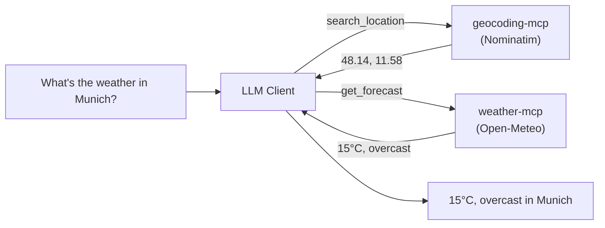

# Step 03: Weather MCP Server(s)

This step demonstrates wrapping external APIs with the MCP protocol — and, more
importantly, how an LLM **composes tools across two independent MCP servers**.

It is split into two phases, each a standalone MCP server:

| Phase | Server | API | Tool |
|-------|--------|-----|------|
| [phase-1-weather](./phase-1-weather) | `weather-mcp` | [Open-Meteo](https://open-meteo.com/en/docs) | `get_forecast(latitude, longitude)` |
| [phase-2-geocoding](./phase-2-geocoding) | `geocoding-mcp` | [Nominatim](https://nominatim.org/release-docs/latest/api/Search/) | `search_location(query)` |

## Why Two Servers?

Open-Meteo only accepts **coordinates**, not place names. Rather than cram
geocoding into the weather server, we build geocoding as its **own** server.
That mirrors the real world (your weather server + someone else's geocoding
server) and lets us show the payoff of MCP:

> Ask an MCP client *"What's the weather in Munich?"* and the LLM calls
> `search_location` (geocoding server) to get coordinates, then `get_forecast`
> (weather server) with them — **two servers, one natural-language request.**



## Suggested Order

1. Build & test **phase 1** (weather) on its own — notice it needs coordinates.
2. Build & test **phase 2** (geocoding) on its own.
3. Register **both** in an MCP client and ask a plain-language weather question.

## Wiring Both Into a Client

Register both servers at once (e.g. Claude Desktop `claude_desktop_config.json`,
or any MCP host). Use absolute paths to each `src/index.ts`:

```json
{
  "mcpServers": {
    "weather": {
      "command": "npx",
      "args": ["tsx", "/abs/path/to/step-03-weather-mcp/phase-1-weather/src/index.ts"]
    },
    "geocoding": {
      "command": "npx",
      "args": ["tsx", "/abs/path/to/step-03-weather-mcp/phase-2-geocoding/src/index.ts"]
    }
  }
}
```

Then try: **"What's the weather in Munich?"** — watch the client call both servers.
