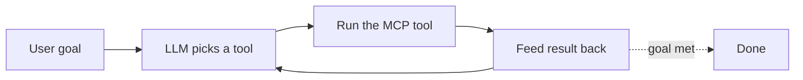
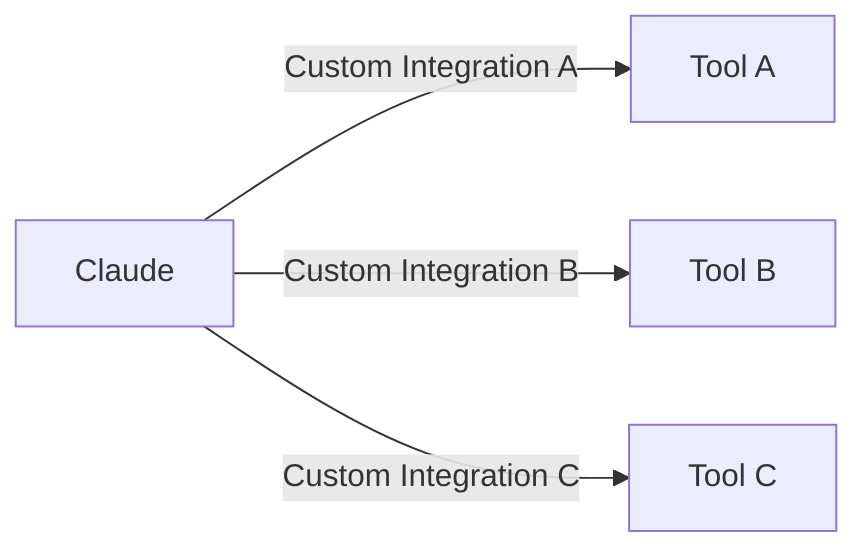
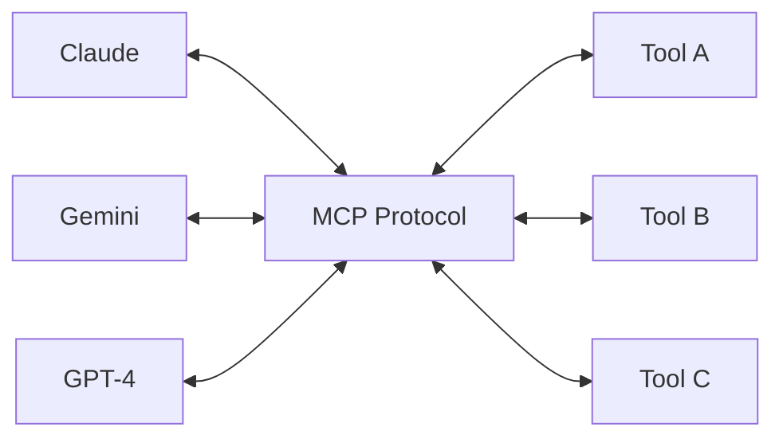
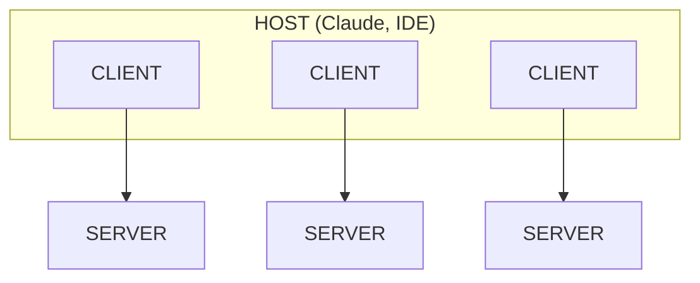
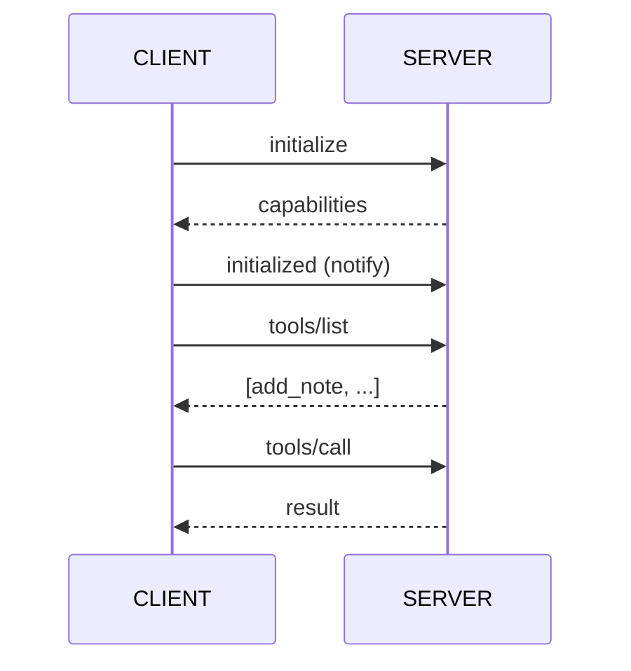
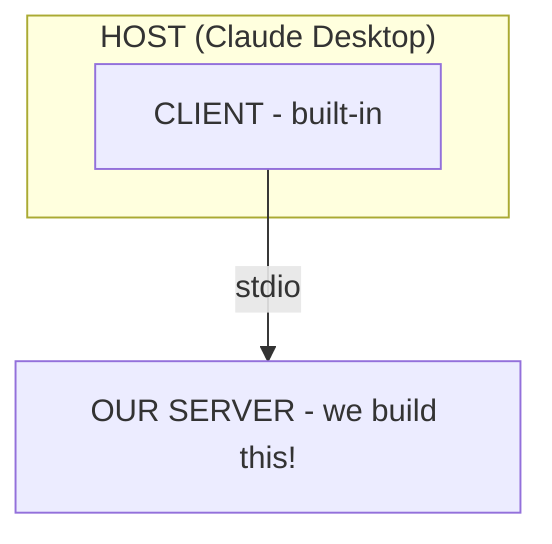
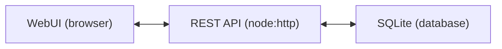
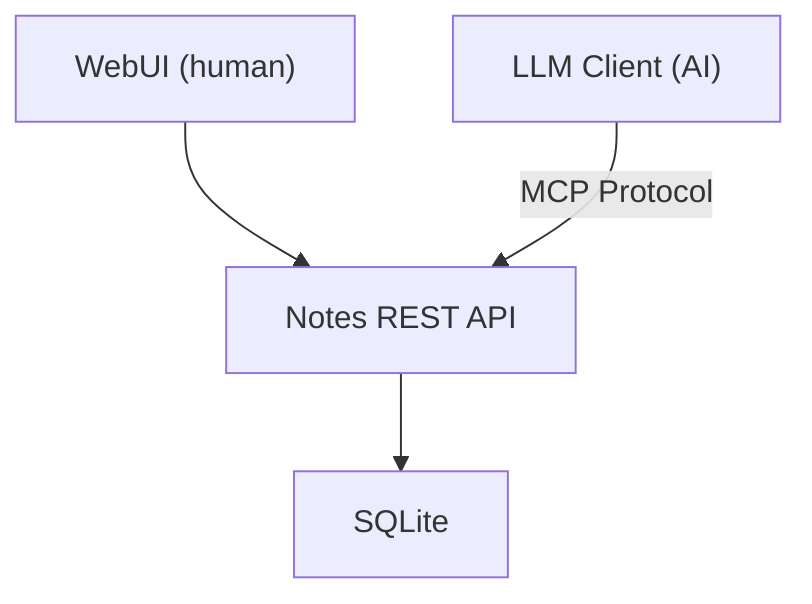

# Block 1: Introduction and Notes App

---

## Welcome to VibeKode!

### Build Your Own MCP Server and Develop AI Agents from Scratch

**Lars Gregori**
AI Engineer

**Johannes Engelke**
Customer Experience (CX) Consultant

---

## What We Will Build Today

A **Personal Knowledge Assistant** that can:

- Store and search your notes
- Fetch weather information
- Generate summaries and brainstorming sessions

**All through natural language!**

---

## Where This Is Going: Agents

Everything you build today is **fuel for an agent loop**:



Your MCP tools are the *actions*; the agent is the *loop* that chooses and
chains them. We build the tools first - then close the loop in **Block 5**.

---

## How We Will Build It

**Vibe Coding Style**

- Use AI assistants (Claude Code, Cursor, Copilot)
- Iterate quickly, learn by doing
- Focus on understanding, not typing

---

## Workshop Flow

| Step | Content |
|------|---------|
| **Demo** | See all MCP servers in action |
| **Step 01** | Notes App walkthrough (pre-built) |
| **Step 02** | Build Notes MCP server incrementally |
| **Step 03** | Weather API as MCP server |
| **Integration** | Connect servers to LLM clients |
| **Agents** | Put tools in a loop - build an agent |
| **Security** | Defend the agent before you ship |

---

## Ground Rules

1. **Ask questions anytime**
2. **Help your neighbors**
3. **Use AI assistants freely**
4. **It's okay to use solutions if stuck**
5. **Have fun!**

---

## What is MCP?

### Model Context Protocol

> The USB-C for AI applications

A standardized protocol that connects LLMs to external tools and data.

---

## Before MCP: The Problem



**Every LLM + Every Tool = Explosion of integrations**

---

## After MCP: The Solution



**One protocol to rule them all**

---

## MCP Architecture



---

## Host vs. Client vs. Server

| Role | What it is | Example |
|------|-----------|---------|
| **Host** | The app the user interacts with | Claude Desktop, Cursor |
| **Client** | Connector inside the host, one per server | MCP client instance |
| **Server** | Exposes tools, resources, prompts | Our Notes & Weather MCP |

**One host can run many clients - one client talks to one server.**

---

## What is an MCP Client?

The **client** lives inside the host and is the other half of the protocol.

It is the piece that:

- Opens a connection to **one** MCP server
- Speaks JSON-RPC 2.0 over a transport
- Bridges the server's capabilities to the LLM

**We build servers today - but every server needs a client to talk to.**

---

## What the Client Does

1. **Connect**: start/attach to the server over a transport
2. **Initialize**: handshake + negotiate protocol version
3. **Discover**: list `tools`, `resources`, `prompts`
4. **Relay**: pass them to the LLM, forward tool calls
5. **Return**: hand results back to the LLM and user

---

## Client ↔ Server Handshake



**Capabilities are negotiated, not hard-coded.**

---

## Transports

How the client and server actually exchange messages:

| Transport | Use case |
|-----------|----------|
| **stdio** | Local server as a subprocess (our setup) |
| **Streamable HTTP** | Remote / hosted servers |
| **SSE** | Legacy HTTP streaming |

The same JSON-RPC messages flow over any transport.

---

## We Build Servers - Clients Consume Them



We focus on the **server**; the host ships the **client**.

---

## MCP Components

| Component | Purpose | Example |
|-----------|---------|---------|
| **Tools** | Actions LLM can call | `add_note`, `get_forecast` |
| **Resources** | Read-only data | `notes://recent` |
| **Prompts** | Reusable templates | `daily_summary` |

> The host hands these tools to the LLM in every request - we'll see the exact
> `tools` format in **Block 4**.

---

## Demo: All Three MCP Servers

Let me show you what we will build today...

1. **Notes MCP** - Manage personal notes
2. **Weather MCP** - Get weather data
3. **External MCP** - Community servers

*[Live demo]*

---

## Step 01: Notes App

### What's Already Built

- Node.js HTTP REST API (no framework) on port 3001
- SQLite database for notes
- WebUI to interact with notes

**Your job:** Understand it, not build it!

---

## Step 01: Start the App

```bash
cd Code/step-01-notes-app
npm install
npm run dev
```

Open: http://localhost:3001

---

## Step 01: WebUI Features

Try these in the browser:

1. **Add a note** with content and tags
2. **Search** for notes by keyword
3. **Delete** a note
4. **View** all your notes

---

## Step 01: API Endpoints

The WebUI calls these REST endpoints:

| Method | Endpoint | Purpose |
|--------|----------|---------|
| GET | `/notes` | List all notes |
| POST | `/notes` | Create note |
| GET | `/notes/search?q=` | Search notes |
| DELETE | `/notes/:id` | Delete note |

---

## Step 01: Database Schema

```sql
CREATE TABLE notes (
    id INTEGER PRIMARY KEY AUTOINCREMENT,
    content TEXT NOT NULL,
    tags TEXT,
    created_at DATETIME DEFAULT CURRENT_TIMESTAMP,
    updated_at DATETIME DEFAULT CURRENT_TIMESTAMP
);
```

---

## Step 01: Code Walkthrough

Let's look at the key files:

- `src/index.ts` - Node.js HTTP server + routes
- `src/database.ts` - SQLite operations
- `public/` - WebUI (HTML/CSS/JS)

---

## Understanding the Pattern



**Next:** Add MCP layer so LLMs can use this too!

---

## What's Next



---

## Break Time

Back in 15 minutes!

**Explore:**
- Add some notes via the WebUI
- Try searching and deleting
- Look at the code if curious

---

*Next: [Block 2 - Build Notes MCP Server](02-notes-mcp.md)*
