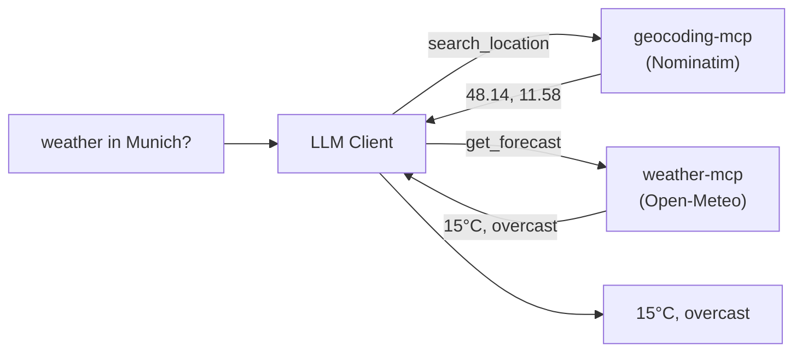
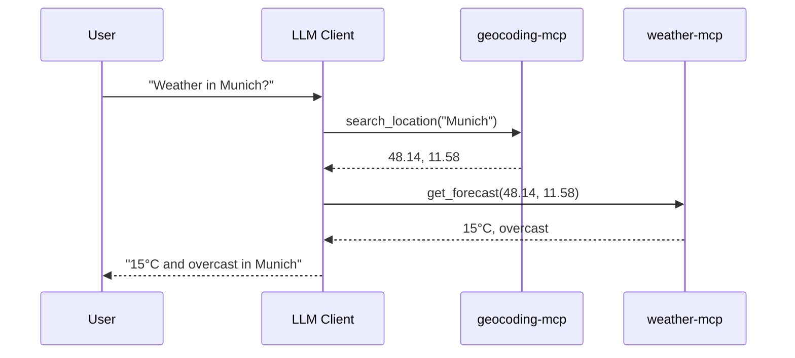

# Block 3: Weather MCP Server

---

## External APIs as MCP

### A Different Pattern

Notes MCP: Database → MCP
Weather MCP: **External API → MCP**

Same MCP protocol, different data source!

---

## Why Wrap External APIs?

- **Unified Interface**: LLM uses same MCP protocol
- **Error Handling**: Graceful failures
- **Transformation**: Shape data for LLM
- **Caching**: Reduce API calls (optional)

---

## This Block: Two Servers

We build **two independent MCP servers** in two phases:

| Phase | Server | API |
|-------|--------|-----|
| **1** | `weather-mcp` | Open-Meteo (forecast) |
| **2** | `geocoding-mcp` | Nominatim (place → coords) |

Then we let **one LLM client use both at once**.

---

## Why Two Servers?

### The catch with Open-Meteo

It only accepts **coordinates** - not "Munich".

So we build geocoding as its **own** server, then chain them:



Mirrors the real world: your server + someone else's server.

---

## Phase 1: Weather Server

### Open-Meteo

Free, no authentication, coordinates in → weather out.

```bash
curl "https://api.open-meteo.com/v1/forecast\
?latitude=48.14&longitude=11.58\
&current=temperature_2m,relative_humidity_2m,wind_speed_10m,weather_code"
```

---

## Open-Meteo Response

```json
{
  "current": {
    "temperature_2m": 15.3,
    "relative_humidity_2m": 65,
    "wind_speed_10m": 10.2,
    "weather_code": 3
  },
  "current_units": {
    "temperature_2m": "°C",
    "wind_speed_10m": "km/h"
  }
}
```

`weather_code` is a WMO code we translate to text (`3` → "Overcast").

---

## Weather Tool

```typescript
const forecastTool = {
  name: 'get_forecast',
  description: 'Get current weather for a latitude/longitude.',
  inputSchema: {
    type: 'object',
    properties: {
      latitude:  { type: 'number', description: 'e.g. 48.1374' },
      longitude: { type: 'number', description: 'e.g. 11.5755' }
    },
    required: ['latitude', 'longitude']
  }
};
```

---

## Fetching Weather

```typescript
async function getForecast(latitude: number, longitude: number) {
  const url = new URL('https://api.open-meteo.com/v1/forecast');
  url.searchParams.set('latitude', String(latitude));
  url.searchParams.set('longitude', String(longitude));
  url.searchParams.set('current',
    'temperature_2m,relative_humidity_2m,wind_speed_10m,weather_code');

  const response = await fetch(url);
  if (!response.ok) throw new Error(`Weather API error: ${response.status}`);

  const data = await response.json();
  // Transform to our format...
}
```

---

## Transforming Response

```typescript
const { current, current_units } = data;

return {
  latitude,
  longitude,
  temperature: `${current.temperature_2m}${current_units.temperature_2m}`,
  condition: WEATHER_CODES[current.weather_code] ?? 'Unknown',
  humidity: `${current.relative_humidity_2m}%`,
  wind: `${current.wind_speed_10m} ${current_units.wind_speed_10m}`
};
```

`WEATHER_CODES` maps WMO codes → text: `0` Clear, `3` Overcast, `61` Rain, …

---

## Weather Resource

```typescript
const weatherResourceTemplate = {
  uriTemplate: 'weather://forecast/{latitude}/{longitude}',
  name: 'Weather Forecast',
  description: 'Current weather data for a latitude/longitude',
  mimeType: 'application/json'
};
```

Resource handler parses the URI and calls the same `getForecast(...)`.

---

## Test Phase 1

```bash
cd Code/step-03-weather-mcp/phase-1-weather
npm install
npx @modelcontextprotocol/inspector npx tsx src/index.ts
```

### Checklist
- [ ] `get_forecast` with `48.1374, 11.5755` (Munich)
- [ ] `weather://forecast/48.1374/11.5755` resource
- [ ] Notice: it needs **coordinates**, not a city name 👈

---

## Phase 2: Geocoding Server

### Nominatim (OpenStreetMap)

Place name → coordinates. Free, but **requires a `User-Agent`**.

```bash
curl "https://nominatim.openstreetmap.org/search\
?q=Munich&format=json&limit=5" \
  -H "User-Agent: vibekode-geocoding-mcp/1.0"
```

A **separate** MCP server - single responsibility.

---

## Nominatim Response

```json
[
  {
    "display_name": "München, Bayern, Deutschland",
    "lat": "48.1371079",
    "lon": "11.5753822",
    "type": "city"
  }
]
```

We map this to `{ name, latitude, longitude, type }`.

---

## Geocoding Tool

```typescript
const searchLocationTool = {
  name: 'search_location',
  description: 'Search a place by name and return coordinates.',
  inputSchema: {
    type: 'object',
    properties: {
      query: { type: 'string', description: '"Munich" or "Marienplatz, Munich"' }
    },
    required: ['query']
  }
};
```

---

## Geocoding a Place

```typescript
async function searchLocation(query: string, limit = 5) {
  const url = new URL('https://nominatim.openstreetmap.org/search');
  url.searchParams.set('q', query);
  url.searchParams.set('format', 'json');
  url.searchParams.set('limit', String(limit));

  const response = await fetch(url, {
    headers: { 'User-Agent': 'vibekode-geocoding-mcp/1.0 (workshop example)' }
  });
  if (!response.ok) throw new Error(`Geocoding API error: ${response.status}`);

  const data = await response.json();
  return data.map((i) => ({
    name: i.display_name, latitude: Number(i.lat), longitude: Number(i.lon), type: i.type
  }));
}
```

---

## Test Phase 2

```bash
cd Code/step-03-weather-mcp/phase-2-geocoding
npm install
npx @modelcontextprotocol/inspector npx tsx src/index.ts
```

### Checklist
- [ ] `search_location` with "Munich" → note lat/lon
- [ ] `search_location` with "Marienplatz, Munich"
- [ ] `geo://search/Munich` resource

---

## Putting It Together

Register **both** servers in one MCP client:

```json
{
  "mcpServers": {
    "weather": {
      "command": "npx",
      "args": ["tsx", "/abs/.../phase-1-weather/src/index.ts"]
    },
    "geocoding": {
      "command": "npx",
      "args": ["tsx", "/abs/.../phase-2-geocoding/src/index.ts"]
    }
  }
}
```

---

## The Payoff

Ask the client:

> **What's the weather in Munich?**



**One question - the LLM orchestrates two servers.**

---

## Error Handling Pattern

```typescript
try {
  const weather = await getForecast(latitude, longitude);
  return { content: [{ type: 'text', text: formatWeather(weather) }] };
} catch (error) {
  return {
    content: [{ type: 'text', text: `Failed: ${error.message}` }],
    isError: true
  };
}
```

---

## Extension Challenge

### Add a Daily Forecast!

Open-Meteo also returns multi-day forecasts.

```bash
curl "https://api.open-meteo.com/v1/forecast?latitude=48.14&longitude=11.58\
&daily=temperature_2m_max,temperature_2m_min,precipitation_sum"
```

Extend `get_forecast` with the `daily` parameters to show the days ahead.

---

## Three MCP Servers

Now you have:

1. **Notes MCP** - Personal data + CRUD
2. **Weather MCP** - External API wrapper (coordinates)
3. **Geocoding MCP** - External API wrapper (place → coords)

All speak the same MCP protocol!

---

## Key Differences

| Notes MCP | Weather / Geocoding MCP |
|-----------|-------------------------|
| SQLite database | HTTP API calls |
| One server, 4 tools | Two servers, 1 tool each |
| 4 resources | 1 resource template each |
| 3 prompts | No prompts |
| Complex | Simple, composable |

---

## The Power of MCP

```json
{
  "mcpServers": {
    "notes":     { "command": "..." },
    "weather":   { "command": "..." },
    "geocoding": { "command": "..." }
  }
}
```

LLM can use tools from **all** servers - and chain them!

---

## Break Time

Back in 15 minutes!

**Next:**
- Connecting MCP servers to LLM clients
- Exploring community MCP servers

---

*Next: [Block 4 - Integration](04-integration.md)*
