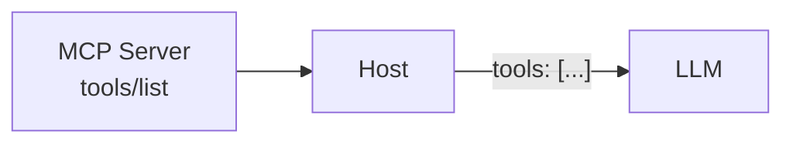
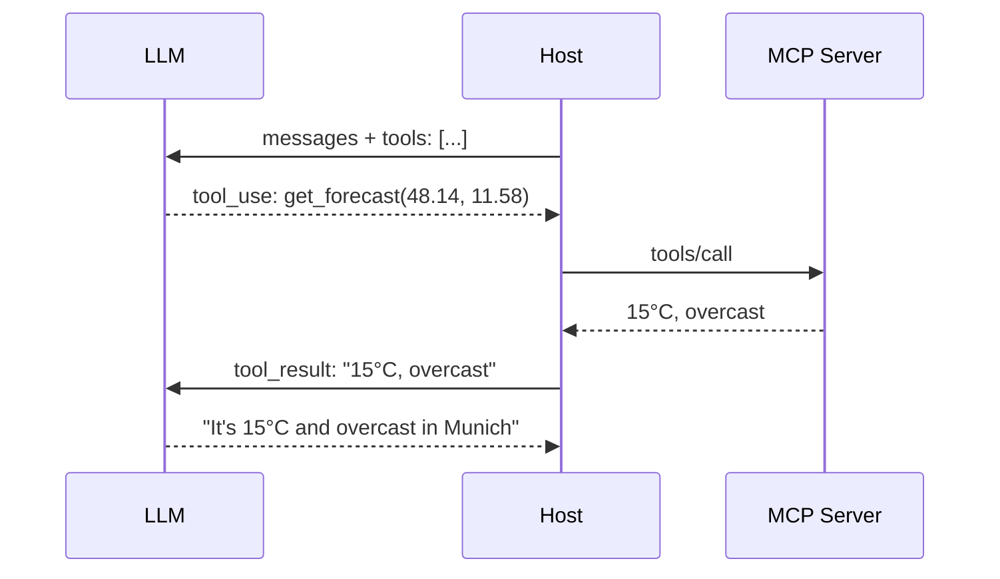
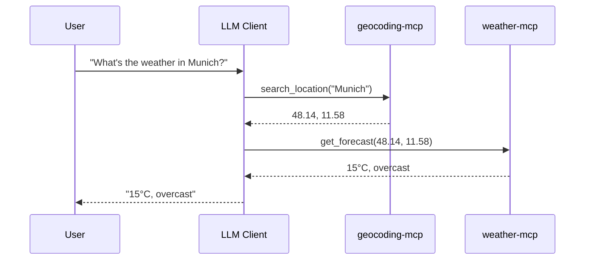

# Block 4: Integration

---

## What We Built

- **Notes MCP Server** (tools, resources, prompts)
- **Weather MCP Server** (external API wrapper)

Now: **Connect to LLM clients!**

---

## MCP Client Options

| Client | Description |
|--------|-------------|
| Claude Desktop | Anthropic's desktop app |
| Cursor | AI-powered IDE |
| Cline (VS Code) | VS Code extension |
| Gemini CLI | Google's CLI tool |
| Custom | Build your own! (see appendix) |

> **Want to build the client side too?** The optional
> [Build Your Own MCP Client](appendix-mcp-client.md) appendix walks through it
> and makes the protocol concrete.

---

## Configuration Pattern

Build once (`npm run build`), then point the client at the compiled output:

```json
{
  "mcpServers": {
    "notes-mcp": {
      "command": "node",
      "args": ["/path/to/dist/index.js"]
    }
  }
}
```

Running `node dist/index.js` starts faster and more reliably than spawning `npx tsx` on every launch.

---

## How It Works

1. Client spawns server process
2. Connects via stdio
3. Discovers capabilities (tools, resources, prompts)
4. Makes them available to LLM

---

## "Available to LLM" - How?

The LLM never talks to your server directly.

The host puts the discovered tools into the **`tools` property** of
every request it sends to the model.



The model sees a menu of tools - and picks from it.

---

## The `tools` Property

Each request to the model carries the tool definitions:

```json
{
  "model": "claude-opus-4-8",
  "messages": [{ "role": "user", "content": "What's the weather in Munich?" }],
  "tools": [
    {
      "name": "get_forecast",
      "description": "Get the weather forecast for a location",
      "input_schema": {
        "type": "object",
        "properties": {
          "latitude": { "type": "number" },
          "longitude": { "type": "number" }
        },
        "required": ["latitude", "longitude"]
      }
    }
  ]
}
```

---

## What the Model Does With It

- **`name`**: the model returns this to say *which* tool to run
- **`description`**: the model reads this to decide *when* to use it
- **`input_schema`**: constrains the *arguments* the model generates

> Same three fields you defined on the MCP server - the host just
> forwards them. Good descriptions = good tool choices.

---

## MCP → LLM: Same Fields, Different Names

The host translates each MCP tool into the model's tool format:

| MCP (`tools/list`) | Claude API (`tools`) |
|--------------------|----------------------|
| `name` | `name` |
| `description` | `description` |
| `inputSchema` | `input_schema` |

The host owns this mapping - you just define the tool **once**.

---

## The Round Trip



`tools` advertises; `tool_use` selects; `tools/call` executes.

---

## Claude Desktop Config

**macOS:**
```
~/Library/Application Support/Claude/claude_desktop_config.json
```

**Windows:**
```
%APPDATA%\Claude\claude_desktop_config.json
```

---

## Claude Desktop Example

```json
{
  "mcpServers": {
    "notes-mcp": {
      "command": "node",
      "args": ["/full/path/to/Code/step-02-notes-mcp/complete/dist/index.js"]
    },
    "weather-mcp": {
      "command": "node",
      "args": ["/full/path/to/Code/step-03-weather-mcp/phase-1-weather/dist/index.js"]
    },
    "geocoding-mcp": {
      "command": "node",
      "args": ["/full/path/to/Code/step-03-weather-mcp/phase-2-geocoding/dist/index.js"]
    }
  }
}
```

Run `npm run build` in each server folder first, then restart Claude Desktop after changes!

---

## Live Demo

### Natural Language Interaction

1. "What's the weather in Munich?"
2. "Add a note about the workshop"
3. "Show me my recent notes"
4. "Summarize my notes"

---

## What Just Happened?



LLM chose the right tools - across **two** servers - automatically!

---

## External MCP Servers

### Community Servers

Browse: https://github.com/modelcontextprotocol/servers

Examples:
- **Filesystem** - Read/write files
- **GitHub** - Issues, PRs, repos
- **Slack** - Send messages
- **PostgreSQL** - Database queries

---

## Try an External Server

### Filesystem MCP

```json
{
  "mcpServers": {
    "filesystem": {
      "command": "npx",
      "args": ["-y", "@modelcontextprotocol/server-filesystem", "/path/to/allow"]
    }
  }
}
```

---

## Explore More Servers

**Your choice!** Pick an official reference server to explore:

- **Filesystem** - Read/write files with access controls
- **Git** - Read, search & manipulate repos
- **Memory** - Knowledge-graph persistent memory
- **Fetch** - Pull & convert web content

Browse them all → [modelcontextprotocol/servers](https://github.com/modelcontextprotocol/servers)

---

## Multi-Server Setup

```json
{
  "mcpServers": {
    "notes": { "command": "..." },
    "weather": { "command": "..." },
    "filesystem": { "command": "..." },
    "github": { "command": "..." }
  }
}
```

LLM can use tools from **all** servers!

---

## Production Considerations

### Before you ship

- **Validation** - Never trust LLM arguments (next slide)
- **Logging** - Observe what your tools actually do
- **Security** - The real threats get their own block → **Block 6**

> Security is not a footnote. We close the workshop with it.

---

## Production: Validation

```typescript
if (typeof args.id !== 'number' || args.id < 0) {
  return {
    content: [{ type: 'text', text: 'Invalid note ID' }],
    isError: true
  };
}
```

---

## Production: Logging

```typescript
console.error('Tool called:', {
  tool: name,
  args,
  timestamp: new Date().toISOString()
});
```

Use stderr (stdout is for MCP protocol).

---

## Advanced: SSE Transport

For remote deployment:

```typescript
import { SSEServerTransport } from '@modelcontextprotocol/sdk/server/sse.js';

const transport = new SSEServerTransport('/mcp', expressApp);
await server.connect(transport);
```

---

## What We Covered

1. **MCP Protocol** - The USB-C for AI
2. **Tools** - Actions LLMs can call
3. **Resources** - Read-only data access
4. **Prompts** - Reusable templates
5. **Integration** - Connecting to clients

Now: put these tools in a loop → **Agents**

---

## Key Takeaways

1. **MCP standardizes AI integrations**

2. **Build incrementally** - Scaffold → Tools → Resources → Prompts

3. **MCP Inspector** - Test without LLM

---

## More Takeaways

4. **Same protocol, different sources** - Database or API

5. **Multi-server** - LLMs can use many servers at once

6. **Production needs security** - Always validate!

---

## Your Materials

```
Code/
├── step-01-notes-app/    # REST API + WebUI
├── step-02-notes-mcp/    # MCP Server (4 phases)
└── step-03-weather-mcp/  # External API wrapper
```

---

## Keep Building!

Ideas for your own MCP servers:

- **Calendar** - Events and reminders
- **Email** - Inbox management
- **Git** - Repository operations
- **Database** - Custom queries
- **API wrapper** - Any service!

---

## Resources

- **MCP Spec**: https://modelcontextprotocol.io/specification
- **SDK Docs**: https://modelcontextprotocol.io/docs
- **Reference servers**: https://github.com/modelcontextprotocol/servers
- **Awesome MCP servers**: https://github.com/wong2/awesome-mcp-servers
- **Try MCP in your browser**: https://try-mcp.dev

---

## From plumbing to autonomy

You can build MCP servers. You can connect them to a client.

So far the LLM takes **one step at a time**. Next we close the loop:
let the model call these tools repeatedly, on its own, until the goal
is met - that's an **agent**.

**And once it acts autonomously, security stops being optional.**

*Next: [Block 5 - AI Agents: From Tools to Autonomy](05-agents.md)*
