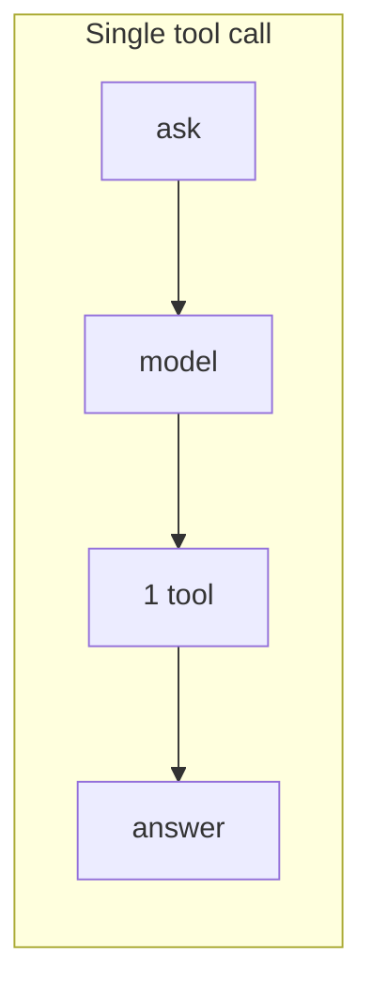
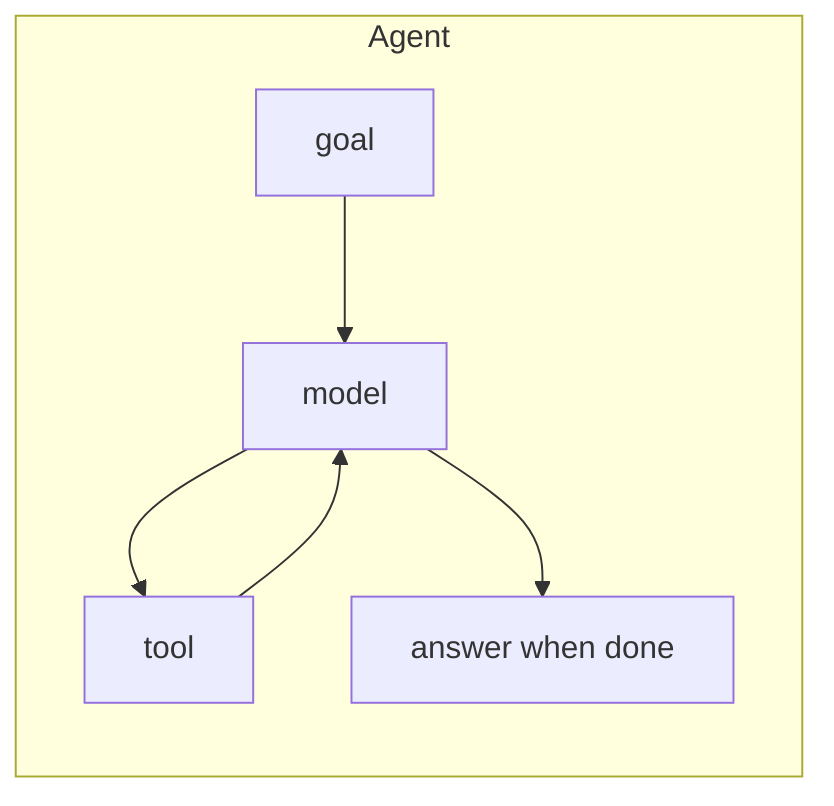
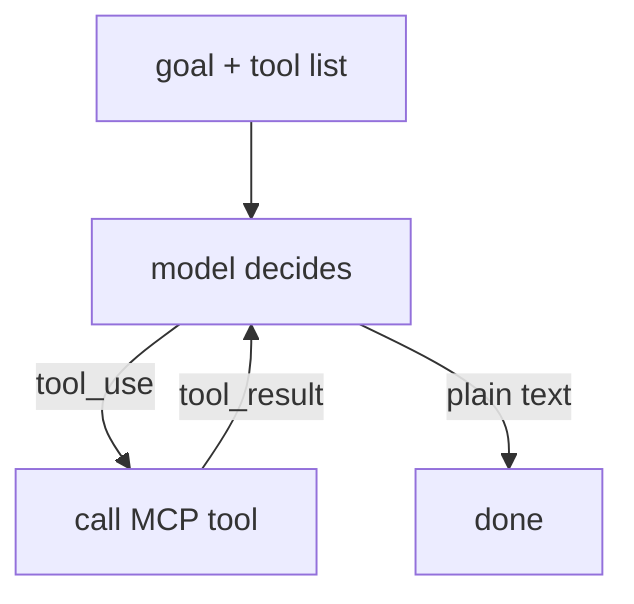
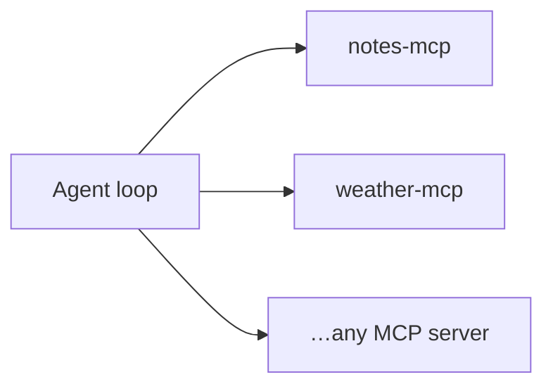
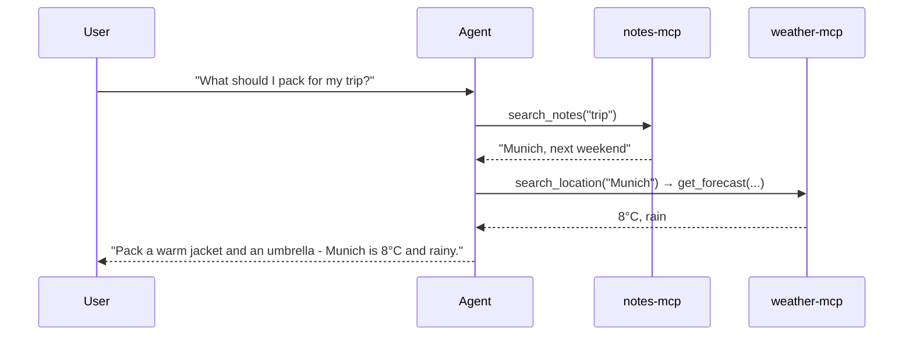
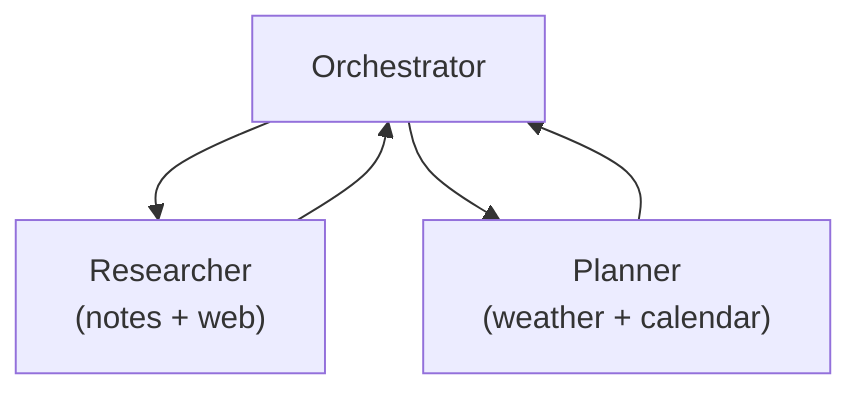

# Block 5: AI Agents - From Tools to Autonomy

### A tool call is one move. An agent plays the whole game.

---

## Where we are

We built servers, then connected them to a client that hands the LLM a
**menu of tools**. So far each request is a single round trip:

> ask → maybe one tool call → answer.

That's useful. But the LLM still drives one step at a time, and *you*
restart it each turn.

An **agent** closes the loop: it keeps calling tools until the goal is
met - no human pressing "go" between steps.

---

## What is an agent?

> An **agent** is an LLM running in a loop, using tools to act on the
> world until a goal is reached.

Three ingredients, nothing more:

| Ingredient | In our workshop |
|------------|-----------------|
| **A model** | Claude (`claude-opus-4-8`) |
| **Tools** | whatever our MCP servers expose |
| **A loop** | call tool → feed result back → repeat |

The model supplies the *reasoning*. MCP supplies the *capabilities*.
The loop supplies the *autonomy*.

---

## Tool call vs. agent: a single call



One pass: ask, model, one tool, answer. No loop, no follow-up decision.

---

## Tool call vs. agent: the agent loop



Same pieces. The difference is the **back-edge**: results return to the
model, and *it* decides whether to act again or stop.

---

## The agent loop



1. Send the goal **plus the tool list** to the model.
2. Model replies with either a **tool call** or a **final answer**.
3. On a tool call: run it via MCP, append the result, **loop**.
4. On plain text: the goal is met - stop.

This is the entire job of a host like Claude Desktop or Cursor.

---

## The loop in code

```typescript
import Anthropic from "@anthropic-ai/sdk";

const anthropic = new Anthropic(); // reads ANTHROPIC_API_KEY

// MCP tools → the model's tool format (host does this for you)
const { tools } = await client.listTools();
const llmTools = tools.map((t) => ({
  name: t.name,
  description: t.description,
  input_schema: t.inputSchema,
}));

const messages = [{ role: "user", content: "Plan my day from my notes" }];

while (true) {
  const res = await anthropic.messages.create({
    model: "claude-opus-4-8",
    max_tokens: 1024,
    tools: llmTools,
    messages,
  });
  messages.push({ role: "assistant", content: res.content });

  const calls = res.content.filter((b) => b.type === "tool_use");
  if (calls.length === 0) break; // no more tools → goal reached

  for (const call of calls) {
    const result = await client.callTool({ name: call.name, arguments: call.input });
    messages.push({
      role: "user",
      content: [{ type: "tool_result", tool_use_id: call.id, content: result.content }],
    });
  }
}
```

`while (true)` is the agent. Everything else is plumbing.

---

## Why MCP is the agent's superpower

With MCP, **adding a server adds a skill** - no retraining, no glue code:



Connect the Notes and Weather servers we built, and the same loop can read
notes, look up locations, and fetch forecasts - reasoning across all of them.

---

## A multi-step run

> What should I pack for my trip in my notes?



The user named **no tools**. The agent planned the sequence, chained
**two servers**, and synthesized one answer.

---

## Planning & reasoning

The model isn't guessing tool-by-tool blindly - between steps it can:

- **Decompose** the goal ("find the trip" → "get its weather").
- **Use a result** to choose the next tool (city → forecast).
- **Recover** from errors (no notes found → ask the user).
- **Decide it's done** and write the final answer.

Each loop iteration is a fresh chance to re-plan with everything learned
so far. That feedback is what separates an agent from a script.

---

## Stop conditions (don't skip these)

Real agents bound the loop - never an unbounded `while (true)`:

- **Max iterations**: cap the number of tool rounds (e.g. 10).
- **Token / cost budget**: stop when spend exceeds a limit.
- **Goal check**: model returns plain text, or a "done" signal.
- **Human checkpoint**: pause before risky actions (→ Block 6).

```typescript
for (let step = 0; step < 10; step++) { /* ...loop... */ }
```

> A runaway agent is a *looping* mistake, not just a wrong answer.

---

## Single agent → multi-agent

One loop is plenty for today. As tasks grow, a common pattern is an
**orchestrator** that delegates to focused sub-agents:



Each sub-agent is its own loop with its own tools. Start with one;
reach for many only when the work truly splits.

---

## The flip side: autonomy is the risk

Everything that makes an agent powerful makes it dangerous:

| Power | …is also |
|-------|----------|
| Acts without you in the loop | acts on **bad** input without you |
| Reads tool results to decide | obeys instructions **hidden** in them |
| Chains tools across servers | can chain *read* → *exfiltrate* |

The loop that reads your notes and reaches the network is exactly the
shape attackers target. **That's Block 6.**

---

## Takeaways

1. An **agent = model + tools + a loop**. The loop is the whole idea.
2. The loop is `ask → tool_use → tool_result → repeat → answer` - the
   host's entire job, in ~20 lines.
3. **MCP makes agents extensible**: every server you connect is a new skill.
4. The model **plans across steps**, using each result to pick the next.
5. **Always bound the loop**: max steps, budget, and a human on risky actions.

> You now have both halves: servers that *expose* capability, and the loop
> that *wields* it. One thing left before you ship.

---

*Next: [Block 6 - MCP Security: When the Data Attacks](06-security.md)*
