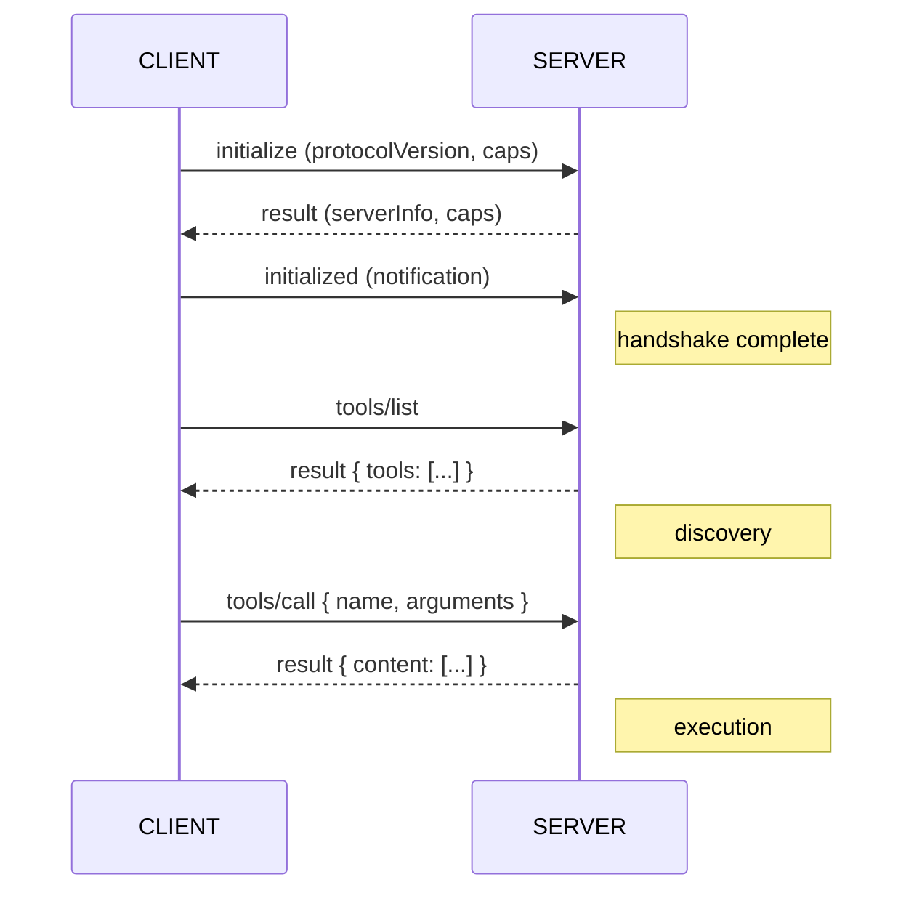

# Appendix: Build Your Own MCP Client

> **Optional add-on.** The main workshop builds MCP *servers* and lets a host
> (Claude Desktop, Cursor, …) supply the *client*. This appendix flips it
> around: you build the **client** yourself. It is the best way to actually
> *see* the MCP protocol - the handshake, discovery, and tool calls - instead
> of taking the host's word for it.

Pairs with Extension Challenge #12 and the "What is an MCP Client?" slides in
Block 1.

---

## Why Build a Client?

So far the host shipped the client and you never saw the wire. But the client
is just the other half of the protocol, and it is small enough to write in an
afternoon. Building one teaches you:

- **What the protocol actually is**: JSON-RPC 2.0 messages over a transport
- **The lifecycle**: connect → initialize → discover → call
- **The boundary**: what the LLM sees vs. what the server exposes

You can build a client with **no LLM at all** (a direct protocol driver, like a
tiny MCP Inspector) and then, optionally, bolt an LLM on top to get a minimal
agent.

---

## The Protocol in One Picture

Client and server exchange **JSON-RPC 2.0** over a **transport**: each
request carries an `id`, `method`, and `params`; each response echoes the `id`.



**Capabilities are negotiated, not hard-coded.** The client asks what exists;
the server answers - the trick that makes one protocol work across every tool.

---

## What the SDK Does for You

The `@modelcontextprotocol/sdk` ships a `Client` class that wraps all of the
above: it sends `initialize`, manages JSON-RPC ids, validates responses, and
gives you typed methods (`listTools`, `callTool`, …). You provide a
**transport** that knows how to move bytes.

```typescript
import { Client } from "@modelcontextprotocol/sdk/client/index.js";
import { StdioClientTransport } from "@modelcontextprotocol/sdk/client/stdio.js";
```

The server side you already know (`Server` + `StdioServerTransport`). The client
side mirrors it exactly.

---

## Step 1: A Minimal Client (No LLM)

This is the equivalent of MCP Inspector in ~30 lines. It launches your Notes
server as a subprocess, completes the handshake, lists what it offers, and calls
one tool.

```typescript
// client.ts
import { Client } from "@modelcontextprotocol/sdk/client/index.js";
import { StdioClientTransport } from "@modelcontextprotocol/sdk/client/stdio.js";

// The transport spawns the server process and speaks stdio to it.
// Point it at your completed Notes MCP server.
const transport = new StdioClientTransport({
  command: "npx",
  args: ["tsx", "../step-02-notes-mcp/complete/src/index.ts"],
});

const client = new Client({ name: "my-cli-client", version: "1.0.0" });

// connect() performs the initialize handshake for you.
await client.connect(transport);

// Discover capabilities
const { tools } = await client.listTools();
console.log("Tools:", tools.map((t) => t.name).join(", "));

const { resources } = await client.listResources();
console.log("Resources:", resources.map((r) => r.uri).join(", "));

// Call a tool
const result = await client.callTool({
  name: "add_note",
  arguments: { content: "Built my own MCP client!", tags: "workshop,mcp" },
});
console.log("Result:", result.content);

await client.close();
```

Run it:

```bash
npm install @modelcontextprotocol/sdk tsx
npx tsx client.ts
```

You just drove the full protocol - initialize, discover, call - without a host
and without an LLM. Everything Claude Desktop does for you, you now do yourself.

---

## Step 2: See the Raw Messages

To *prove* it is just JSON-RPC, log what crosses the wire. The MCP Inspector
shows this in its UI, but you can also peek in your own client.

A `tools/call` request is literally:

```json
{
  "jsonrpc": "2.0",
  "id": 2,
  "method": "tools/call",
  "params": {
    "name": "add_note",
    "arguments": { "content": "Built my own MCP client!", "tags": "workshop,mcp" }
  }
}
```

And the response:

```json
{
  "jsonrpc": "2.0",
  "id": 2,
  "result": {
    "content": [{ "type": "text", "text": "{\"id\":7,\"content\":\"...\"}" }]
  }
}
```

No magic. The SDK just generates these, matches `id`s, and hands you the
`result`. That is "the MCP protocol" - request/response JSON over a pipe.

> **Tip:** Servers must log to **stderr**, never stdout - stdout is reserved for
> these JSON-RPC frames. This is why the workshop uses `console.error(...)` for
> debugging.

---

## Step 3 (Optional): Add an LLM → a Tiny Agent

A client without an LLM is a remote control. Add an LLM and the model decides
*which* tool to call. That is exactly what a host does. The loop is:

1. Send the user's message **plus the tool list** to the LLM.
2. If the LLM responds with a tool call, run it via `client.callTool(...)`.
3. Feed the tool result back to the LLM.
4. Repeat until the LLM answers in plain language.

```typescript
import Anthropic from "@anthropic-ai/sdk";

const anthropic = new Anthropic(); // reads ANTHROPIC_API_KEY

// 1. Translate MCP tools → the LLM's tool format
const { tools } = await client.listTools();
const llmTools = tools.map((t) => ({
  name: t.name,
  description: t.description,
  input_schema: t.inputSchema,
}));

// 2. Ask the model, letting it pick tools
const messages = [{ role: "user", content: "Add a note about the workshop" }];
let response = await anthropic.messages.create({
  model: "claude-opus-4-8",
  max_tokens: 1024,
  tools: llmTools,
  messages,
});

// 3. If it wants a tool, run it through MCP and loop the result back
for (const block of response.content) {
  if (block.type === "tool_use") {
    const result = await client.callTool({
      name: block.name,
      arguments: block.input,
    });
    messages.push({ role: "assistant", content: response.content });
    messages.push({
      role: "user",
      content: [
        { type: "tool_result", tool_use_id: block.id, content: result.content },
      ],
    });
    response = await anthropic.messages.create({
      model: "claude-opus-4-8",
      max_tokens: 1024,
      tools: llmTools,
      messages,
    });
  }
}
```

> The model id above is the current Claude Opus. For the workshop's hosted
> gateway, point the Anthropic SDK's `baseURL` at the LiteLLM gateway instead of
> the public API - see the gateway README.

That loop - discover tools, expose them to the model, execute the model's
choices, feed results back - **is** what Claude Desktop and Cursor do. You've
now built both halves of MCP.

---

## Where to Go Next

- **Browse resources and prompts**, not just tools: `client.readResource({ uri })`,
  `client.listPrompts()`, `client.getPrompt({ name, arguments })`.
- **Connect to multiple servers** from one client (notes + weather) and merge
  their tool lists - a multi-server agent.
- **Swap the transport**: a remote server over Streamable HTTP uses the same
  `Client`, just a different transport import.
- **Read the spec** to see every method: https://modelcontextprotocol.io

---

## Key Takeaways

1. **A client is just the other half of the protocol**: small enough to build.
2. **MCP is JSON-RPC 2.0 over a transport**: initialize, discover, call.
3. **No LLM needed to drive a server**: that is what MCP Inspector is.
4. **Add an LLM and you have an agent**: the host's whole job, in one loop.

---

*Back to: [Block 4 - Integration](04-integration.md) · [Block 5 - AI Agents](05-agents.md) · [Extension Challenges](../EXTENSION_CHALLENGES.md)*
